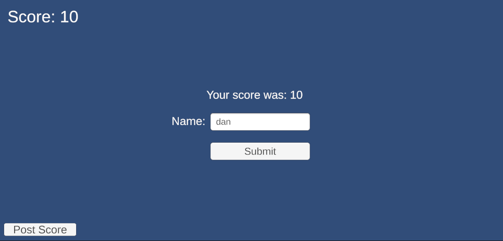

# Introduction

# Implemented requirements
## Peter Hilbert
**Requirement:** As a player, I want to see the high scores so that I can see how I compare to my friends. 
**Issue:** https://github.com/NoomMiner/Ducks-Bath-Defense/issues/41 
**Pull Request:** https://github.com/NoomMiner/Ducks-Bath-Defense/pull/52 
**Implemented by:** Peter Hilbert 
**Approved by:** Daniel Austin  

  
**Requirement:** Players can submit leaderboard entries 
**Issue:** https://github.com/NoomMiner/Ducks-Bath-Defense/issues/42 
**Pull Request:** https://github.com/NoomMiner/Ducks-Bath-Defense/pull/57/ 
**Implemented by:** Peter Hilbert 
**Approved by:** Hunter Kilgore  

## Daniel Austin
**Requirement:** As a player, I want the game to be playable on a website so that I can access it from almost any device, 
**Issue:** https://github.com/NoomMiner/Ducks-Bath-Defense/issues/26 
**Pull Request:** https://github.com/NoomMiner/Ducks-Bath-Defense/pull/49 
**Implemented by:** Daniel Austin 
**Approved by:** Peter Hilbert  

# Tests

# Adopted Technologies
- Unity: Game engine that we're using to code the game itself. We chose this because it's one of the most common game engines, so it would be easy to find help online if needed.
- AWS ec2: This allows us to host the website using secure virtual servers. We chose it because it's free for students, and ec2 allows PHP to work on the server.
- Filezilla: For transferring files between our local devices and the web server. This was already familiar to many of us due to using it in cs212, so it made sense to use it again here.
- MySQL: A database management system, we're using this for the game's leaderboard. Some members of our group are using this in cs345, so we chose this because it's familiar to us.
- PHP: A scripting language we're using for the database. This is a very commonly used language for dynamic website content and has support for MySQL.
- GitHub: For version control, issue tracking, and containing all the files for the project. Git and GitHub are incredibly popular systems for software project development, we all had some prior experience with it due to the cs tools courses, and it was recommended in this class.
- Discord: A messaging platform we are using as our primary method of communication. Discord allows us to organize our communication into multiple channels, have voice and video calls for our online meetings, upload any files we need, and more. Every member of our group has already used Discord for communication before, and it allows us to communicate easily outside of class and meetings, so it was an easy choice.

# Learning/training
Most of the technologies we are using were either new or something that the group didn't have a lot of prior experience with. Because of this, we were often learning the technologies as we used them. We've utilized lots of online tutorials, plus just group communication and asking each other questions. If a group member is unsure of how to do something, we will ask the group, and we'll either get help from someone who knows what they're doing or collaborate on figuring out the answer. We make sure to share any information or skills we learn along the way. So while we don't necessarily have one cohesive strategy, we have been able to learn as we go by communicating, asking questions, and using online resources when needed.

# Deployment
We are currently deploying our system by hosting our webGl unity game on an AWS EC2 server instance using the Amazon Linux platform. This kind of server allows us to do serverside scripting so that we can use PHP. The latest version of the game is built and then hosted on the server where it can then be accessed.

The link to the website: https://ec2-18-117-249-64.us-east-2.compute.amazonaws.com/

# Licensing
We're choosing to use the GNU General Public License v3.0 (GNU GPLv3). This license allows us to remain open source, and requires anyone who would use our code in the future to be open source as well, by using this same license. We chose this license because we value open-source code and want our project to remain open source in all future iterations.

# README File
[README.md](/README.md) 
[CONTRIBUTING.md](/CONTRIBUTING.md) 
[LICENSE](/LICENSE)
# Look & Feel
Home Page UI

 
 
Leaderboard Page UI

 
 
Game Page UI

# Lessons learned
Much of this release was spent learning how to use the technologies, how they work together, and how our group best works together. We've learned that using Discord works best for communication in our group, but we've made sure to also focus on using GitHub so we have experience with it in the future. We've also had to learn how to make sure we get work organized and done throughout the week without having to rely on the weekly meeting to organize everything. This is a lesson we will definitely carry with us into the next release. Another thing is that not everyone in our group needs to know everything about the entire project. We do update each other on what we're doing so we all know what's happening, but we don't all need to know how to do everything. Having specific people to work on the website, the leaderboard, etc. allows us to "divide and conquer" and ultimately work together better. For the next release, we'll put more effort into time management - assigning specific tasks throughout the week and communicating if we have issues getting them done. We've recently gotten better at this, and it's helped our workflow a lot.

# Demo
