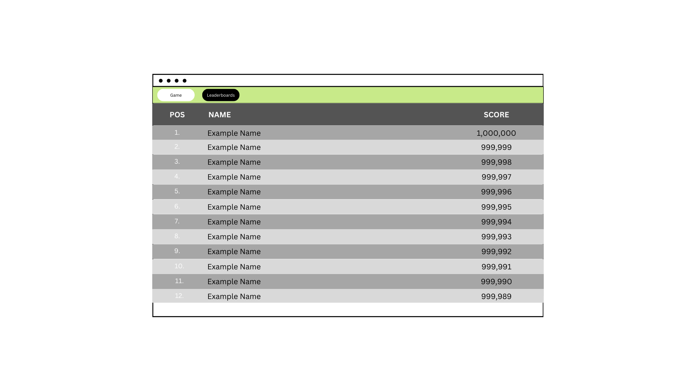

# Deliverable 2
## 1. Positioning
### Problem statement
The problem of heavyweight, complicated computer games affects casual gamers; the impact of which is unnecessary time and money spent just to enjoy a video game.

### Product position statement
For casual gamers who are looking for quick and easy entertainment, Duck's Bath Defense is a tower defense game that is short, simple, and can be played in your browser; unlike Bloons Tower Defense, our product offers variety in gameplay as the player progresses through the game while still keeping it simple.

### Value proposition and customer segment
**Value proposition:** Duck's Bath Defense is a web-based tower defense game that provides casual gamers with a game they can play anytime, anywhere, while still delivering an interesting and compelling gameplay experience. 
**Consumer segment:** Casual gamers who want a fun, relaxing, and lightweight gaming experience.

## 2. Stakeholders
**Casual gamers:** They will be the main user base for our product, and we will rely on their feedback to improve our project. 
**Mobile game developers:** They have a similar user base to us, so they will serve as both a standard to follow and something we make sure we stand out from. 
**Developers:** We will be responsible for delivering content to our user base, who we will keep in contact with to ensure we create a product they want to use.

## 3. Functional requirements
1. Allow "creative mode" to customize gameplay
2. A fast forward feature to accelerate time
3. A point system, points earned by killing enemies
4. Between waves players will be able to purchase upgrades, can be skipped
5. You can spend currency to upgrade existing towers, helpful items
6. Changing weekly gamemodes
7. Predetermined enemy path
8. Sound effects
9. A pause menu
10. A compendium that allows you to read about enemies / units
11. Start of waves allow you to see upcoming enemy types
12. Placeable grid for tower units
13. Enemies are ducks
14. Enemies attack the towers
15. Enemy spawning that scales off of play time
16. Enemies come in waves
17. Enemies have varying levels of strength
18. Enemies and towers will have hit points to keep track of damage
19. Start menu screen
20. The game will be accessed on a website
21. Compatibility on different devices
22. High score to be saved on the website (Ability to see top 10 and score neighbors) 
23. Scale formatting for different devices
24. Hosting the game on a .io website
25. Warning before closing tab
26. Must have censorship for entered names
27. All-time, weekly and weekly challenge mode score tables
28. All-time score table will show top 20
29. Weekly score table will clear weekly
30. User's names are stored with scores
31. Have a save option to save the games current state

## 4. Non-Functional requirements
1. **Easily Accessible** - the URL of the website should be able to be memorized by users
2. **Modular** - It should not take more than 1-3 hours to implement a new enemy type, tower type, etc.
3. **Portable** - should be playable on the most common browsers
4. **Confidentiality** - The website should not require any user data to be accessed and played
5. **Functional Completeness** - players should be able to complete a full gameplay loop
6. **Resource Utilization** - Be lightweight and able to be used on any device
7. **Capacity** - Encompassing database to save usernames and highscores
8. **Modifiability** - The core game can be customized by the user for different preferred playing experiences
9. **User Interface Aesthetics** - Simple interface that is intuitive to anyone using the game

## 5. MVP
In order to complete a vision for our minimum viable product, it must be understood that the final product will be split into three separate key areas of requirement. These areas being the game itself, the website it will be hosted on, and finally, the database meant for tracking scores. With this understanding, we can securely state the vision of our MVP.

**The Game** will be created using the Unity game engine. Using this engine, we can test our game's functionality every step of the way, easily collaborate on code using the Git support found within, and work on an engine that allows ease of access from what we need to have for our project. As for the game itself, only the bare essentials are required to complete the requirements of the game. Firstly, we need a single basic enemy type and defense unit type to be able to combat and interact with one another. Afterwards, we need a wave system that ramps the amount of enemies that spawn and allows a brief grace period for purchasing and placing defense units. There needs to be a playable grid that clearly shows where enemies travel through and where placing defense units is allowed. Additionally, there needs to be a way to differentiate enemies and defensive units in an easily identifiable way. The enemies defeated need to generate both currency and score where currency is used to purchase more defensive units and score is used to be stored in the record database. Finally, there needs to be a defending point that the enemies need to attack where the game ends once the defending point is destroyed.

**The Database** is where the scores of players will be saved and displayed. The requirements of this area is not too complicated. In essence, scores from the game need to be sent to the scoreboard where the player can insert a three character "username" to have associated with their score. A basic profanity filtering system will be applied to ensure hateful and inappropriate language is not permitted. After which, it will be displayed for all users of the website.

**The Website** is the place where all elements will be incorporated for player use. Using AWS, the website will be remotely hosted and accessible by anyone with the URL. We can test its' functionality by implementing HTML files as placeholders and experimenting with it to see what works. The elements of the game and database can then be implemented to the website after thorough testing. Additionally, basic UI elements will be added to format visually and allow a window for the Unity game program to be hosted and played from. This allows the playing of the game without requirement of downloading (a major element in our product's uniqueness and ease of access) and the viewing of the leaderboard for scores.

## 6. Use cases
**Use Case 1:** Add score to leaderboard 
**Actor:** User 
**Trigger:** The user loses the game 
**Pre-Condition:** The user has played a full game 
**Post-Condition:** A new entry will be added to the leaderboard 
**Success Scenario:**

1) The user loses the game
2) The user is prompted for a name to go on the leaderboard
3) The system approves the entered name
4) The system creates a new entry on the leaderboard

**Alternate Scenario:**

3) The system finds that the name is inappropriate or is otherwise invalid
4) The system notifies the user of the requirements for a name
5) The user may try again

**Interface Sketch:** 

**Use Case 2:** Add weekly modes 
**Actor:** Developer 
**Trigger:** Developer decides to add new mode 
**Pre-Condition:** Previous weekly mode is over 
**Post-Condition:** New weekly mode is added 
**Success Scenario:**  

1) The developer designs the weekly mode.
2) The developer attempts to add it to game.
3) The game validates the mode.
4) Informs developer mode is valid
5) Developer activates mode for week

**Alternate Scenario:** 

3) The game does not validate the mode
4) Informs developer that an error occured
5) Ask developer to try again<be>

**Interface Sketch:** 

**Use Case 3:** Access Menus  
**Actor:** User.  
**Trigger:** The user launches the game for the first time.  
**Pre-Condition:** The user accesses the website and allows the game to load.  
**Post-Condition:** The user's screen is redirected to the desired area of prompt.  
**Success Scenario:**

1) The user enters the website and allows the unity game to load.
2) The menu with all options is displayed for the user.
3) The user is then able to select one of the menu options and be redirected elsewhere.
4) The user is capable of traversing through the menu options to start the game, view the leaderboard, or enter the alternative weekly modes.

**Interface Sketch** 

**Use Case 4:** View a leaderboard                                            
**Actor:** Player                                                             
**Trigger:** Player opens leaderboard                                         
**Pre-Condition:** player has accessed website                                
**Post-Condition:** Player sees highscores                                    
**Success Scenario:**                                                        
                                                                                 
1) The user enters the website                                                  
2) The user naviagtes to the leaderboards tab                                   
3) The user sees the all-time leaderboard                                       
                                                                                 
**Interface Sketch**                                                         
 

## 7. User stories
1. As a player, I want a fast forwarding feature so that I can play through the waves faster.
**Hours**: 2 
**Priority**: med

2. As someone who isn't the greatest at games, I want the highscore leaderboard to reset every so often so that I have a chance to see my name on the leaderboards.
**Hours**: 3
**Priority**: low

3. As a player, I want weekly challenge modes so that the game stays fresh.
**Hours**: 8
**Priority**: low

4. As a player, I want the game to be playable on a website so that I can access it from almost any device.
**Hours**: 13
**Priority**: high

5. As a player, I want to see the high scores so that I can see how I compare to my friends.
**Hours**: 8
**Priority**: high

6. As a developer, I want to filter inappropriate usernames so that the game and website are appropriate for all players.
**Hours**: 2
**Priority**: high

7. As developer, I want the design to be modular so that the turnaround for creating features is fast.
**Hours**: 13
**Priority**: high

8. As a player, I want there to be a variety of enemies so that the strategy involved in the game is interesting.
**Hours**: 8
**Priority**: med

9. As a player, I want a pause menu so that I can take small breaks from the game without dying or losing my progress.
**Hours**: 2
**Priority**: low

10. As a player, I want the game to waves of increasing difficulty so that keep the game engaging.
**Hours**: 5
**Priority**: high

## 8. Issue tracker
[Link to issue tracker](https://github.com/NoomMiner/Ducks-Bath-Defense/issues)
 
 

