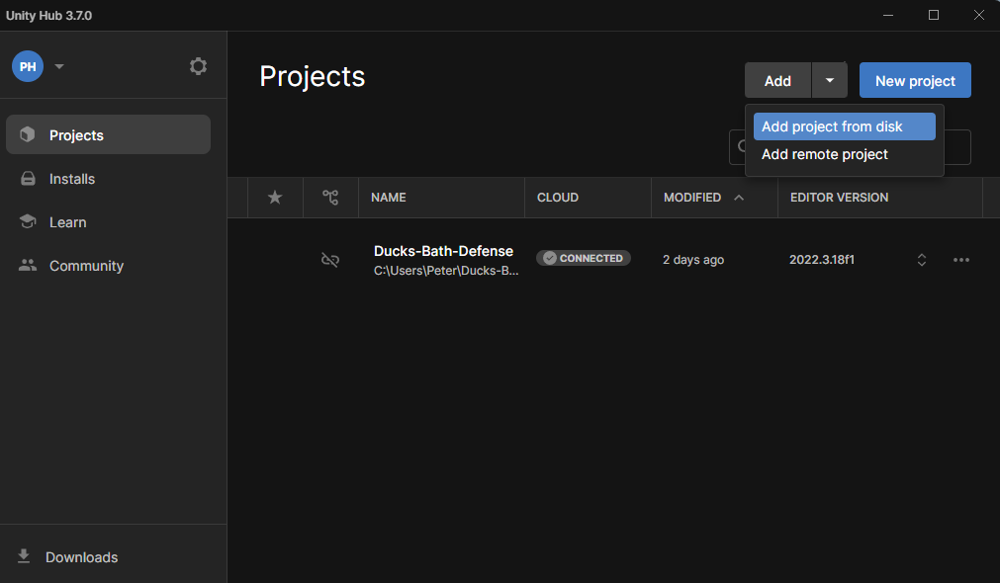

# Duck's Bath Defense 1.0.0
Duck's Bath Defense is a simple tower defense game that can be hosted on the web, perfect to play anywhere you go. Many unique tower and enemy types provides for exciting gameplay, while still providing simplicity and a relaxing experience.
## Getting Started
These instructions will get you a copy of the project on your machine for development purposes.
### Prerequisites
To get started, you'll need to install [Unity Hub](https://unity.com/download), which can be installed on Windows, Mac, or Linux. 
From Unity Hub, you'll also need to install v2022.3.18f1 of the Unity Editor.
### Opening this project with Unity
To open this project with Unity, you'll first have to clone this repo onto your local machine (either this repo or a fork) 
Then, in Unity Hub, navigate to the "Projects" page, and click Add > Add Project From Disk. Find the directory containing your clone and select it. Make sure the editor is the correct version (v2022.3.18f1).

Finally, open the new project from Unity Hub, and you should see a preview of the game in the editor. Hit the "Play" button at the top to play the game in the editor to ensure everything was downloaded correctly.
## Automated Testing
WIP
## Deployment
To deploy the project to a live system, it can be built using WebGL from Unity. These files can then be hosted on an AWS EC2 server.
## Built With
- [Unity Game Engine](https://unity.com) - For building and testing the game
- [MySQL](https://www.mysql.com) - For developing and maintaining backend databases
### Contributing
Please read CONTRIBUTING.md for details on our code of conduct, and the process for submitting pull requests to us.
### Versioning
We use [SemVer](https://semver.org) for versioning.
### Authors
- **Hunter Kilgore** - Scrum Master, Unity work
- **Tyler Bryant** - Archivist, Unity work
- **Peter Hilbert** - Project Manager, database work, Unity work
- **Daniel Austin** - AWS/website management
- **Risa Walles** - Unity work
### License
This project is licensed under the GNU General Public License - see [LICENSE](./LICENSE) for details.